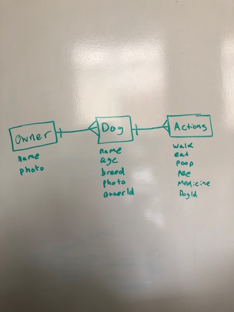

# Project 4

---------------------------------------

## Project Explanation: 

Purpose of project as a problem statement:  
This site/application is for helping families track and document their dog's actions. Actions include: walking, feeding, pooping, peeing, and medicine. This ensures families feed their dog and do not feed their dog excess servings. Track a dog's physical activity, diet, and prescription intake. Additionally lets owners know if the dog needs to be taken out to the restroom.

Target end user:  
My target end user is active families with multiple family members who are busy and need a way of documenting their dog's actions.  This could also be used for pet sitters or eventually dog daycares. 

-------------------------------------------------------------------

## Heroku: 

-------------------------------------------------------------------

## Trello : 
https://trello.com/b/J6Zsdeqv/project-4

-------------------------------------------------------------------

## ERD
 

-------------------------------------------------------------------

## Wireframes

/
 

/dog
 

/dog/:dogId
 

/owner
 

