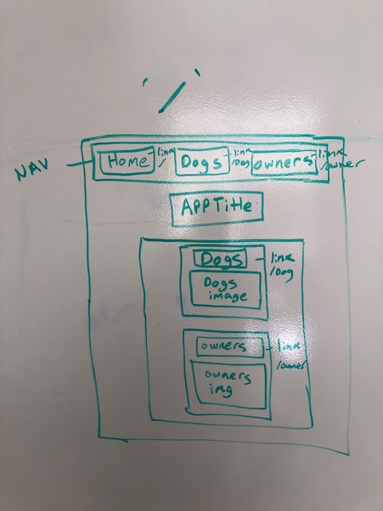
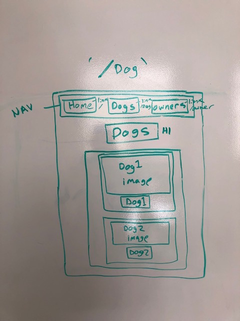
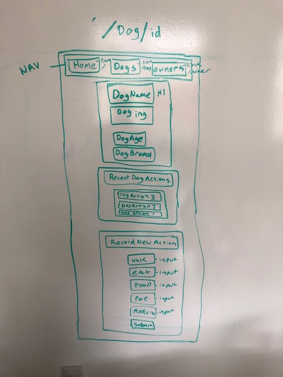
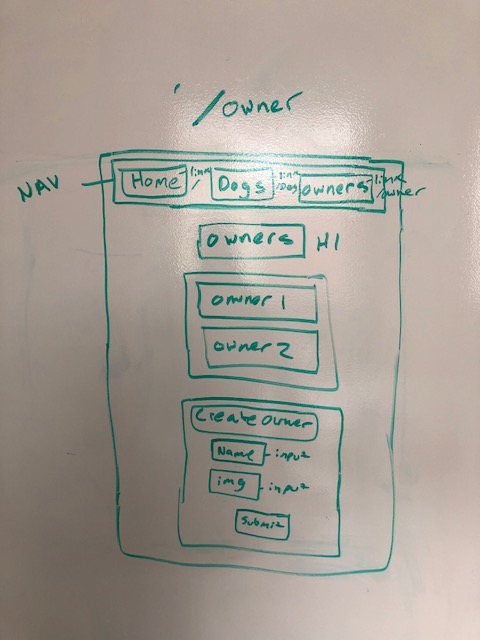

# Project 4

---------------------------------------

## Project Explanation: 

Purpose of project as a problem statement:  
This site/application  

Target end user:  
My target end user is 

-------------------------------------------------------------------

## Heroku: 

-------------------------------------------------------------------

## Trello : 
https://trello.com/b/J6Zsdeqv/project-4

-------------------------------------------------------------------

## ERD
 

-------------------------------------------------------------------

## Wireframes

/
 

/dog
 

/dog/:dogId
 

/owner
 

